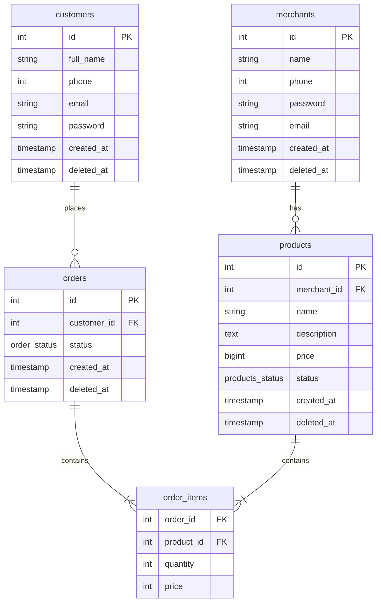
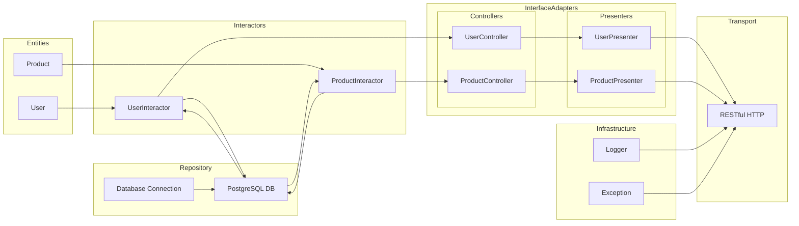

# mystore

API based on REST and Clean Architecture principles.

## Task

[Test-Task](TT.md)

## SQL

[Script](./sql/init_schema.sql) will be initialized upon deploying the Postgres image.

## Database diagram

## Endpoints

Based on the REST design conventions it seems reasonable to follow a common pattern of using nested resources.
This approach makes API more organized and easier to navigate for clients and also reflect the relationship between
resources.

- `/api/merchants/:id/products`
- `/api/customers/:id/orders`
- `/api/orders/:id/items`
- etc.

Flattened structure will look like this.

| Endpoint         | Method   | Description                             |
|------------------|----------|-----------------------------------------|
| `/auth/signup`   | `POST`   | Create a new user account               |
| `/auth/login`    | `POST`   | Auth user with email/phone and password |
| `/auth/login`    | `POST`   | Log out the current user                |
| `/merchants`     | `POST`   | Creates a new merchant                  |
| `/merchants`     | `GET`    | Fetch list of all merchants             |
| `/merchants/:id` | `PUT`    | Updates the merchant by id              |
| `/merchants/:id` | `GET`    | Returns the merchant by id              |
| `/merchants/:id` | `DELETE` | Deletes the merchant by id              |
| `/products`      | `POST`   | Creates a new product                   |
| `/products`      | `GET`    | Fetches a list of all products          |
| `/products/:id`  | `GET`    | Returns the product by id               |
| `/products/:id`  | `PUT`    | Updates the product by id               |
| `/products/:id`  | `DELETE` | Deletes the product by id               |
| `/customers`     | `POST`   | Creates a new customer                  |
| `/customers`     | `GET`    | Fetches a list of all customers         |
| `/customers/:id` | `GET`    | Returns the customer by id              |
| `/customers/:id` | `PUT`    | Updates the customer by id              |
| `/customers/:id` | `DELETE` | Deletes the customer by id              |
| `/orders`        | `POST`   | Creates a new order                     |
| `/orders`        | `GET`    | Fetches a list of all orders            |
| `/orders/:id`    | `GET`    | Returns the order by id                 |
| `/orders/:id`    | `PUT`    | Updates the order by id                 |
| `/orders/:id`    | `DELETE` | Deletes the order by id                 |

## Graph 

